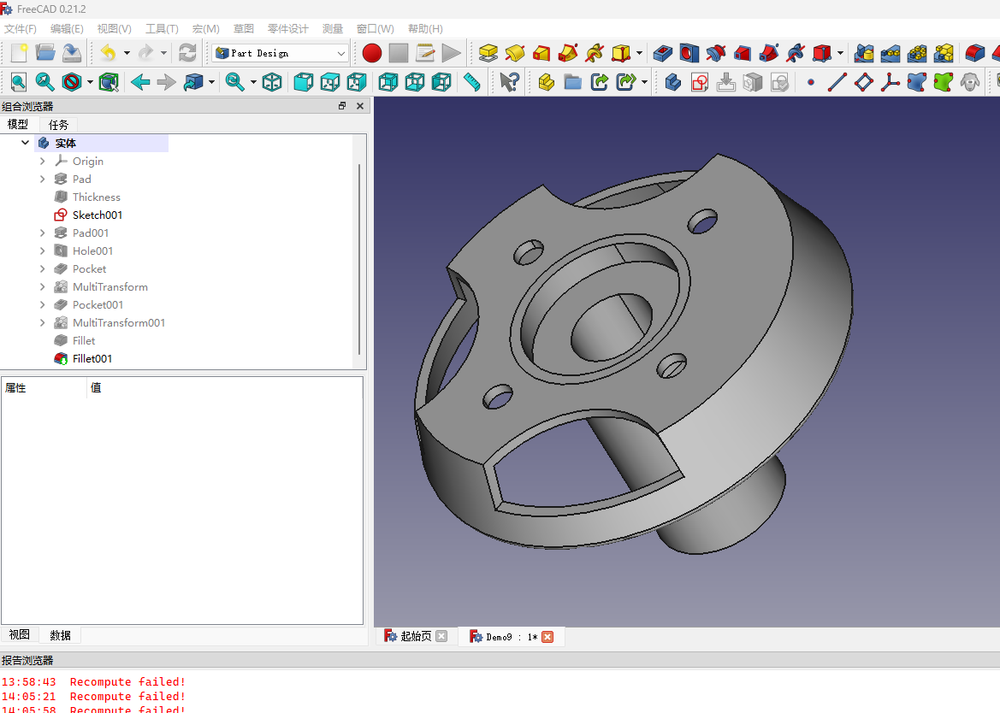
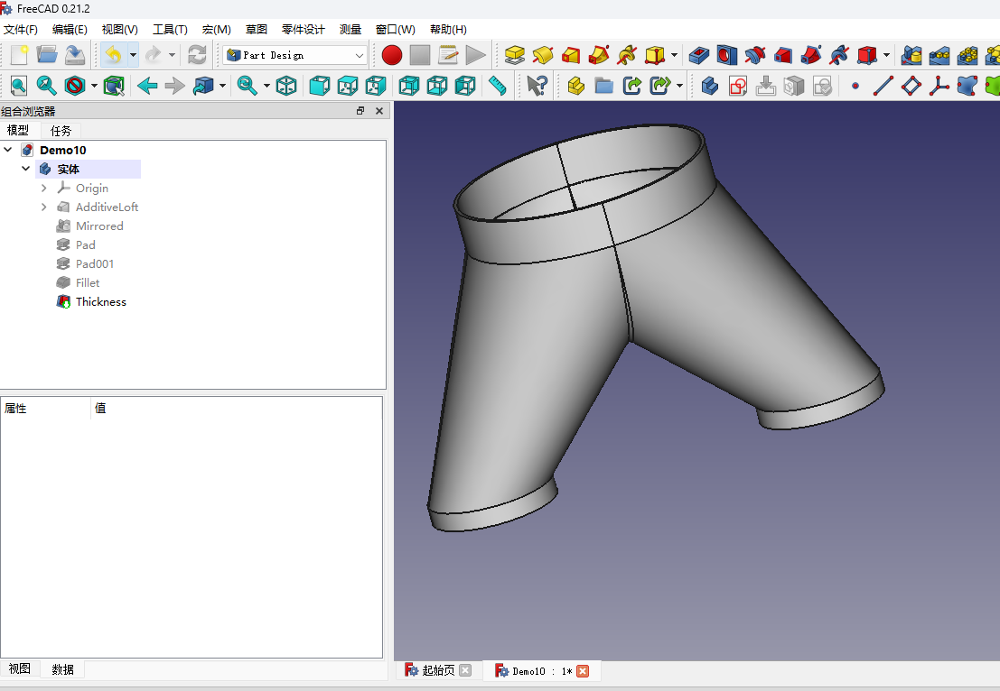
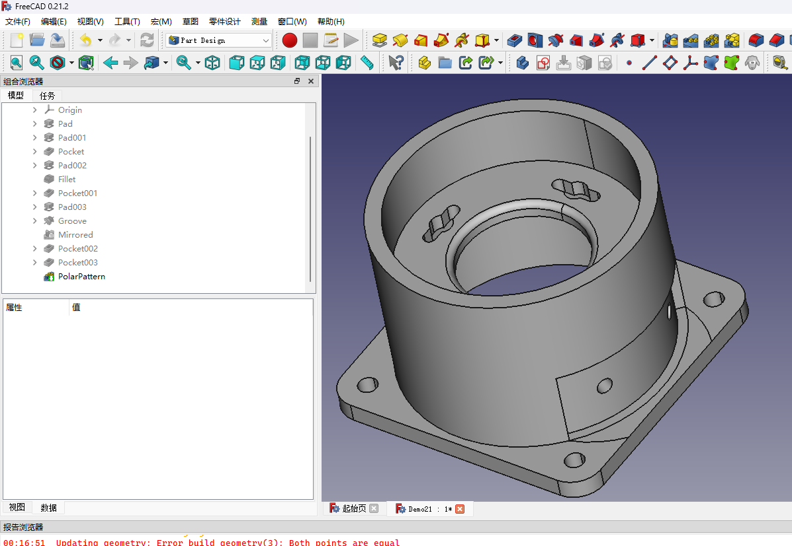
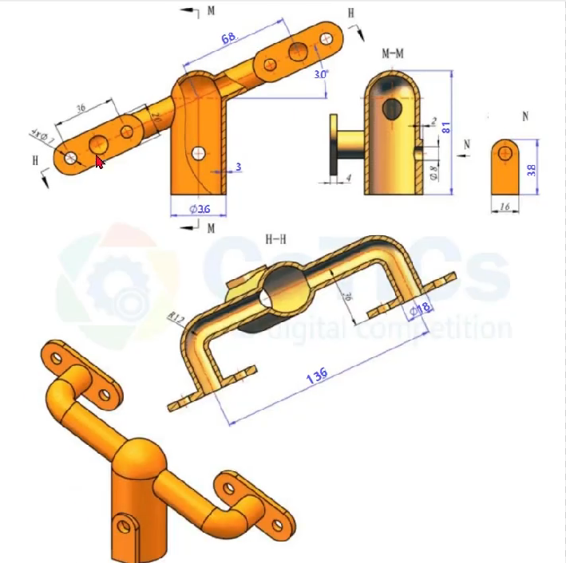

# FreeCAD学习

> 最近想做个3D打印，但是苦于不会建模，只能手绘图纸，想起上学时期，学习AutoCAD,那也玩的相当六。班级作业都是我的版本，都是拷贝我的作业。
>
> 想想今年还是得把这个技能拾起来。
>
> 三维建模软件好多，上学时候学的UG和AutoCAD,但是全部忘记了，感觉FreeCAD开源免费非常不错。
>
> 以后也能研究研究FreeCAD的源代码。好像还是C++Qt写的。加油。2024！

### Demo1

- #### 图纸

- #### 我的实现

### Demo2

- #### 图纸

- #### 我的实现

### Demo3

- #### 图纸

- #### 我的实现
- 

### Demo4

- #### 图纸

- #### 我的实现

    

### Demo5

- #### 图纸

    

- #### 我的实现

​	

### Demo6

- #### 图纸

    

- #### 我的实现

- 

### Demo7

- #### 图纸

    

- #### 我的实现

- 

### Demo8

- #### 图纸

    

- #### 我的实现

- 

### Demo9

- #### 图纸

    

- #### 我的实现

- 

### Demo10

- #### 图纸

    

- #### 我的实现

- 

### Demo11

- #### 图纸

    

- #### 我的实现

- 

### Demo12

- #### 图纸

    

- #### 我的实现

- 

### Demo13

- #### 图纸

    

- #### 我的实现

- 

### Demo14

- #### 图纸

    

- #### 我的实现

- 

### Demo15

- #### 图纸

    

- #### 我的实现

- 

### Demo16

- #### 图纸

    

- #### 我的实现

- 

### Demo17

- #### 图纸

    

- #### 我的实现

- 

### Demo18

- #### 图纸

    

- #### 我的实现

- 

### Demo19

- #### 图纸

    

- #### 我的实现

    

### Demo20

- #### 图纸

    

- #### 我的实现

- 

### Demo21

- #### 图纸

    

- #### 我的实现

    

### Demo22

- #### 图纸

    

- #### 我的实现

    