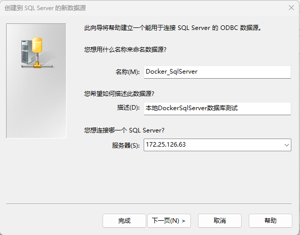

# Docker安装SqlServer

> [Docker：为 Linux 上的 SQL Server 安装容器 - SQL Server | Microsoft Learn](https://learn.microsoft.com/zh-cn/sql/linux/quickstart-install-connect-docker?view=sql-server-ver16&pivots=cs1-bash)

### 1、从 Microsoft 容器注册表中请求 SQL Server 2022 (16.x) Linux 容器映像。

- Bash

```bash
sudo docker pull mcr.microsoft.com/mssql/server:2022-latest
```

- PowerShell

```PowerShell
docker pull mcr.microsoft.com/mssql/server:2022-latest
```

- Windows 命令提示符

```cmd
docker pull mcr.microsoft.com/mssql/server:2022-latest
```


### 2、要使用 Docker 运行 Linux 容器映像

- Bash

```bash
sudo docker run -e "ACCEPT_EULA=Y" -e "MSSQL_SA_PASSWORD=<YourStrong@Passw0rd>" \
   -p 1433:1433 --name sql1 --hostname sql1 \
   -d \
   mcr.microsoft.com/mssql/server:2022-latest
```

> 备注
>
> 如果使用 PowerShell Core，请将双引号替换为单引号。

- PowerShell

```PowerShell
docker run -e "ACCEPT_EULA=Y" -e "MSSQL_SA_PASSWORD=<YourStrong@Passw0rd>" `
   -p 1433:1433 --name sql1 --hostname sql1 `
   -d `
   mcr.microsoft.com/mssql/server:2022-latest
```

- Windows 命令提示符

```cmd
docker run -e "ACCEPT_EULA=Y" -e "MSSQL_SA_PASSWORD=<YourStrong@Passw0rd>" -p 1433:1433 --name Docker_SqlServer --hostname Docker_SqlServer -d mcr.microsoft.com/mssql/server:2022-latest
```

> 密码应符合 SQL Server 默认密码策略，否则容器无法设置 SQL Server，将停止工作。 默认情况下，密码必须为至少八个字符且包含以下四种字符中的三种：大写字母、小写字母、十进制数字、符号。 可使用 [`docker logs`](https://docs.docker.com/engine/reference/commandline/logs/) 命令检查错误日志。

> 默认情况下，本快速入门会创建一个使用 SQL Server 开发人员版的容器。 在容器中运行生产版本的过程略有不同。 有关详细信息，请参阅[运行生产容器映像](https://learn.microsoft.com/zh-cn/sql/linux/sql-server-linux-docker-container-deployment?view=sql-server-ver16#production)。

下表对前一个 `docker run` 示例中的参数进行了说明：

| 参数                                                | 说明                                                         |
| :-------------------------------------------------- | :----------------------------------------------------------- |
| **-e "ACCEPT_EULA=Y"**                              | 将 `ACCEPT_EULA` 变量设置为任意值，以确认接受最终用户许可协议。 SQL Server 映像的必需设置。 |
| **-e "MSSQL_SA_PASSWORD=<YourStrong@Passw0rd>"**    | 指定至少包含 8 个字符且符合 [SQL Server 密码要求](https://learn.microsoft.com/zh-cn/sql/relational-databases/security/password-policy?view=sql-server-ver16)的强密码。 SQL Server 映像的必需设置。 |
| **-e "MSSQL_COLLATION=<\*SQL_Server_collation\*>"** | 指定自定义 SQL Server 排序规则，而不使用默认值 `SQL_Latin1_General_CP1_CI_AS`。 |
| **-p 1433:1433**                                    | 将主机环境中的 TCP 端口（第一个值）映射到容器中的 TCP 端口（第二个值）。 在此示例中，SQL Server 侦听容器中的 TCP 1433，此容器端口随后会对主机上的 TCP 端口 1433 公开。 |
| **--name sql1**                                     | 为容器指定一个自定义名称，而不是使用随机生成的名称。 如果运行多个容器，则无法重复使用相同的名称。 |
| --hostname sql1                                     | 用于显式设置容器主机名。 如果未指定主机名，则主机名默认为容器 ID，这是随机生成的系统 GUID。 |
| **-d**                                              | 在后台运行容器（守护程序）。                                 |
| **mcr.microsoft.com/mssql/server:2022-latest**      | SQL Server Linux 容器映像。                                  |


### 3、修改密码

- 测试环境，目前用不到。

### 4、创建ODBC 连接SQL Server数据库

- 连接到 SQL Server

  - `sudo docker exec -it Docker_SqlServer "bash"`

  - `sudo docker exec -it Docker_SqlServer "bash"`

  - `/opt/mssql-tools/bin/sqlcmd -S localhost -U SA`

  - 完整命令行:

    ```sql
    duxiao@duxiaopc:~$ sudo docker exec -it Docker_SqlServer "bash"
    [sudo] password for duxiao:
    mssql@Docker_SqlServer:/$ ls
    bin  boot  dev  etc  home  lib  lib32  lib64  libx32  media  mnt  opt  proc  root  run  sbin  srv  sys  tmp  usr  var
    mssql@Docker_SqlServer:/$   /opt/mssql-tools/bin/sqlcmd -S localhost -U SA
    Password:
    1>
    ```

- 创建测试数据库

  - 创建数据库:`CREATE DATABASE DuxiaoDB;`

  - 测试查询:`SELECT Name from sys.databases;`

  - 前两个命令没有立即运行。 在新行中键入 `GO` 以运行前面的命令：

    - `GO`

  - 完整命令:

    ```sql
    1> CREATE DATABASE DuxiaoDB;
    2> SELECT Name from sys.databases
    3> go
    Name
    --------------------------------------------------------------------------------------------------------------------------------
    master
    tempdb
    model
    msdb
    DuxiaoDB
    
    (5 rows affected)
    1>
    ```

- 创建ODBC数据库

  

  

  

  

  

  

  

- 使用Navicat 16连接数据库

  
  
  

### 5、删除容器及镜像

​		***好不容易搭建的，我不删除。***

#### 至此测试版Docker SqlServer 搭建完成。

