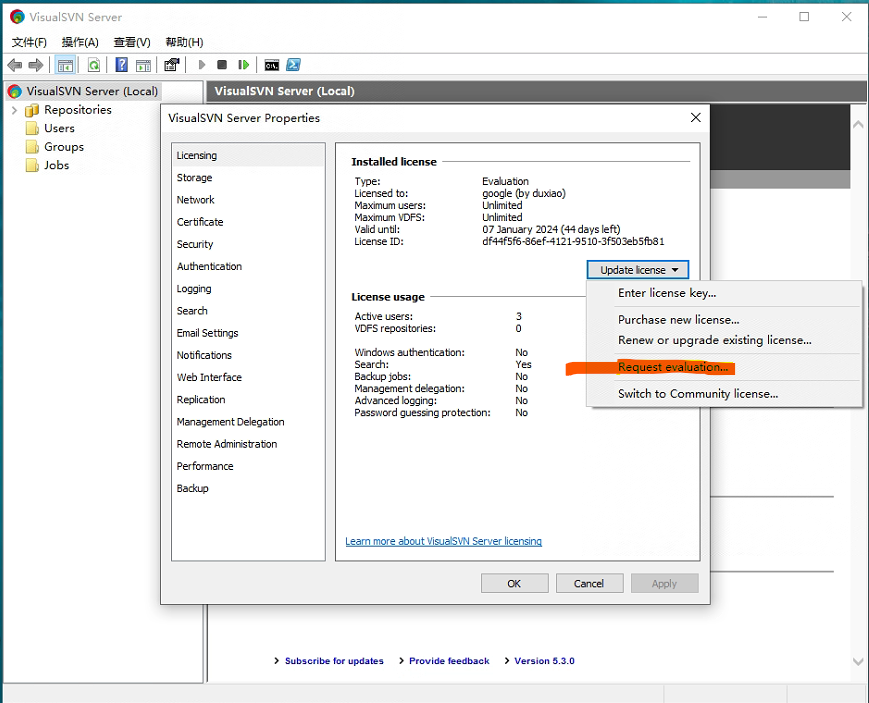
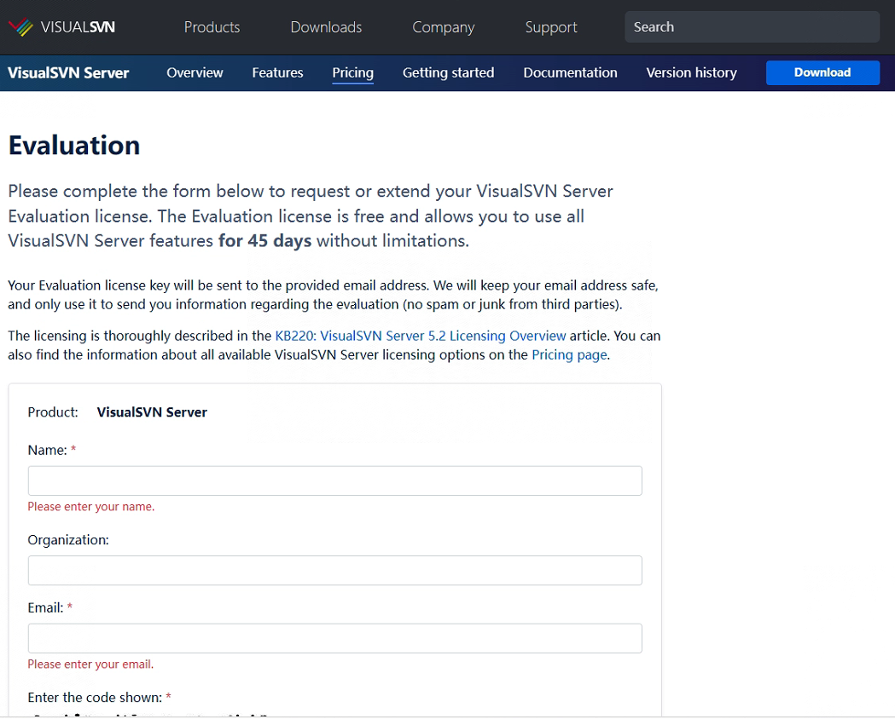
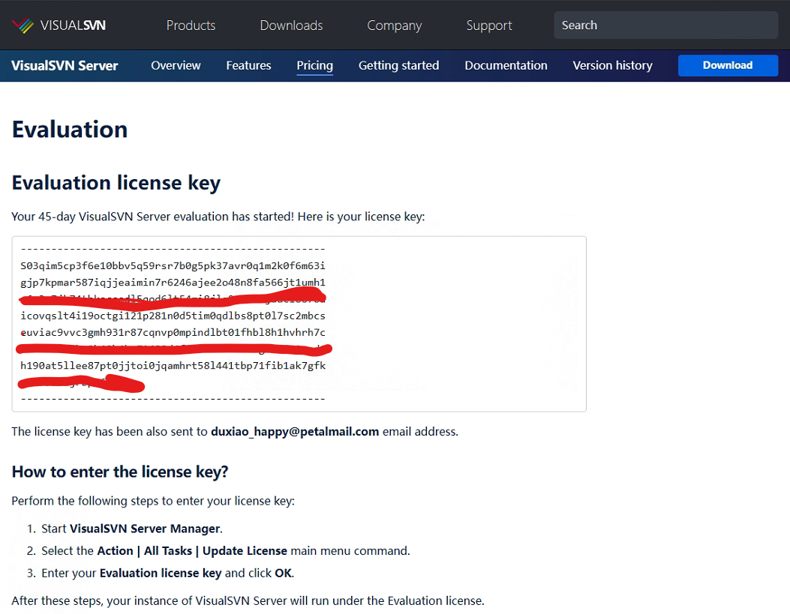
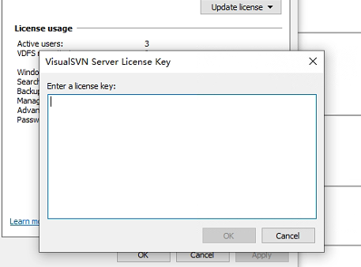

# SVN服务过期处理

> 家里私人使用的SVN 服务器突然不能使用，发现是许可证过期了。找到了如下方法可用。
>
> 运行环境 Win10。

#### SVN出现许可证过期

#### 进行更新许可证

- 点击上图Details，选择Request evaluation 选项。

    

    

#### 然后输入个人和组织信息。

#### 可以获取一个45天临时的使用许可证。

#### 拷贝Evaluation license key，到“进行更新许可证”步骤中选择: Enter License Key，点击确定。

#### 刷新，可以延长45天，45天后重复操作即可一直白嫖~~~

